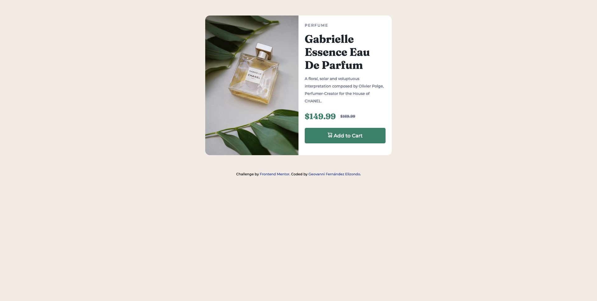

# Frontend Mentor - Product preview card component solution

This is a solution to the [Product preview card component challenge on Frontend Mentor](https://www.frontendmentor.io/challenges/product-preview-card-component-GO7UmttRfa). Frontend Mentor challenges help you improve your coding skills by building realistic projects.

## Table of contents

- [Overview](#overview)
  - [The challenge](#the-challenge)
  - [Screenshot](#screenshot)
  - [Links](#links)
- [My process](#my-process)
  - [Built with](#built-with)
  - [What I learned](#what-i-learned)
  - [Continued development](#continued-development)
  - [Useful resources](#useful-resources)
- [Author](#author)

## Overview

A product preview card component is a UI element used in e-commerce websites to provide users with a quick overview of a product's key features, such as name, image, price, and rating. It is designed to be displayed in a grid format, with multiple cards arranged side-by-side. The component helps users assess the product's suitability and make informed purchasing decisions. It typically follows a consistent visual language and responsive design principles to ensure optimal viewing across devices.

### The challenge

Users should be able to:

- View the optimal layout depending on their device's screen size
- See hover and focus states for interactive elements

### Screenshot

### Links

- Solution URL: [Frontend Mentor Solution](https://www.frontendmentor.io/solutions/responsive-product-card-component-using-html-and-css-grid-and-flexbox-bJq3rTW3a2)
- Live Site URL: [Netlify](https://frontendmentor-product-card-geovanni.netlify.app/)

## My process

### Built with

- Semantic HTML5 markup
- CSS custom properties
- Flexbox
- CSS Grid
- BEM methodology
- Mobile-first workflow

### What I learned

HTML and CSS Basics

Through this exercise, I learned how to correctly build the structure of a website using HTML semantics. Additionally, I gained an understanding of how to design a website with CSS using the BEM methodology, resulting in clean, reusable, and easy-to-maintain code.

### Continued development

I want to continue learning the basics of HTML and CSS until I fully master all their concepts. Then, I want to focus on Javascript to understand its foundations and be able to move forward with its libraries and frameworks, thereby mastering the frontend development area.

### Useful resources

- [Resource 1](https://blog.soyhenry.com/que-son-los-encabezados-en-html/#:~:text=Los%20encabezados) - This helped me to understand how to correctly use headings in HTML.
- [Resource 2](https://blog.ida.cl/desarrollo/metodologia-bem-desarrollo-front-end/#:~:text=BEM%20) - This is an amazing article which helped me finally understand BEM methodology. I'd recommend it to anyone still learning this concept. I really liked this pattern and will use it going forward.

## Author

- Frontend Mentor - [@Geovanex24](https://www.frontendmentor.io/profile/Geovanex24)
- Twitter - [@@geovanex24](https://www.twitter.com/geovanex24)
